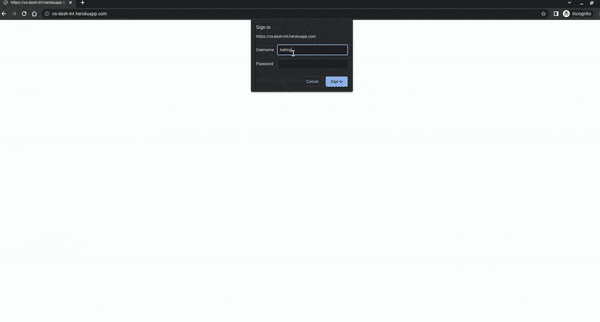
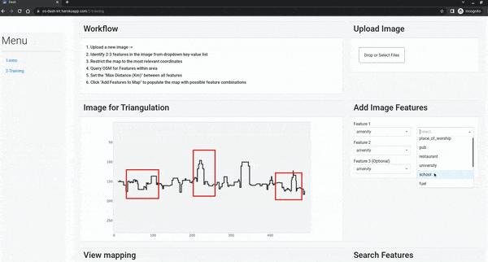
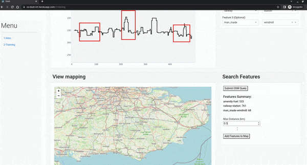

# OS_Dash_INT

## Prerequisites
This Python application requires installation of the requirements.txt file.

This can be done with `pip3 install -r requirements.txt`.

## Example usage
Start the web application by running the command.

```python3 app.py ```

In the terminal the server address should be provided.

## User Notes

### Inspiration

The open question on 'Assisted or semi-automated terrain perspective match' here: https://github.com/bellingcat/open-questions

### Data Source - OverpassAPI
This app queries the OverpassAPI, utilising OSM data.

Currently, we only query 2 or 3 possible 'features' a user has defined. These features are known as 'Nodes' in Overpass and only a limited number of key-value pairs are provided in this demo app. https://wiki.openstreetmap.org/wiki/Node

We make the query using python-overpy: https://github.com/DinoTools/python-overpy

Overpass Website version (Overpass Turbo): https://overpass-turbo.eu/

### User Journey

- User Login
- Upload a new image
- Locate 2/3 features



- Restrict the map to the relevant coordinates
- Query OSM for these features within this space



- Limit the distance between the feature combinations
- Investigate the possible locations



#### Limitations (from Overpass)
Every service has its limitations, and so does Overpass API:

- Downloading big data

As the size of an Overpass API query result is only known when the download is complete, it is impossible to give an ETA while downloading. And the dynamically generated files from Overpass API typically take longer to generate and download than downloading existing static extracts of the same region. As a result, when you want to extract country-sized regions with all (or nearly all) data in it, it's better to use planet.osm mirrors for that. Overpass API is most useful when the amount of data needed is only a selection of the data available in the region.

Source: https://wiki.openstreetmap.org/wiki/Overpass_API#Limitations 

### Other
Dash APP structure influenced by: https://www.purfe.com/dash-project-structure-multi-tab-app-with-callbacks-in-different-files/

Useful Dash resource: https://dash-bootstrap-components.opensource.faculty.ai/docs/quickstart/


